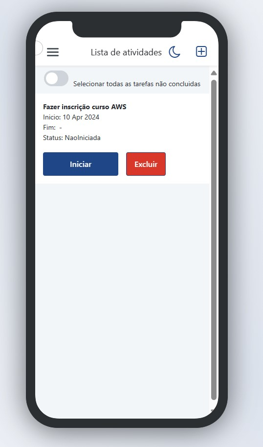

# ToDoList_Outsystems

> Outsytems mobile App

App desenvolvido em Outsystems, durante curso co Tiago Mari, na DIO. O App faz o gerenciamento facil de tarefas. 
Funcionalidade do App:
1. Registrar sua tarefas para não cair no esquecimento, sendo possivel planejar ano, mes e semana.
2. O App tem um gerencimaneto Inteligente, onde é mostrado para você, as tarefas que deverão ser planejada naquele dia. Mas é possivel visualizar todas as tarefas planejadas.
3. Você consegue visualizar seus historico de atividades e assim tirar a duvida de qual atividade você fez na ssemana passada.

[🔗 Clique aqui para acessar](https://personal-i56aztoz.outsystemscloud.com/PreviewInDevices/ShareMobileApp.aspx?URL=/ToDoList/&_ts=88579)

## 🛠 Tecnologias

 
  
  
   
  

  

## 💛 Contato

joeljerrys95@gmail.com
